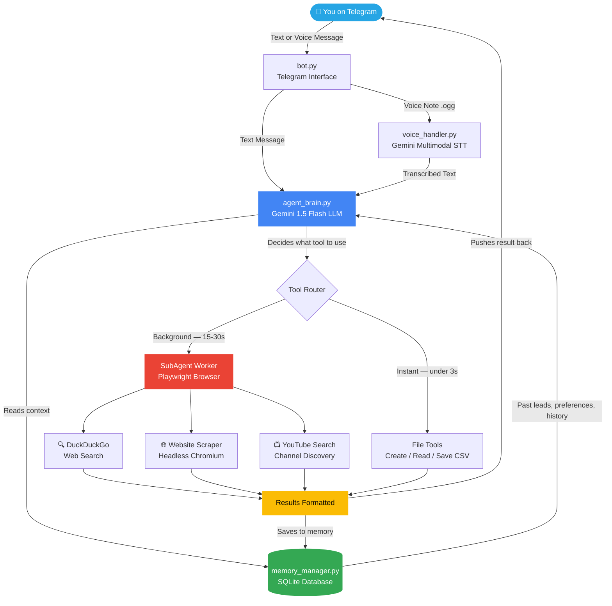
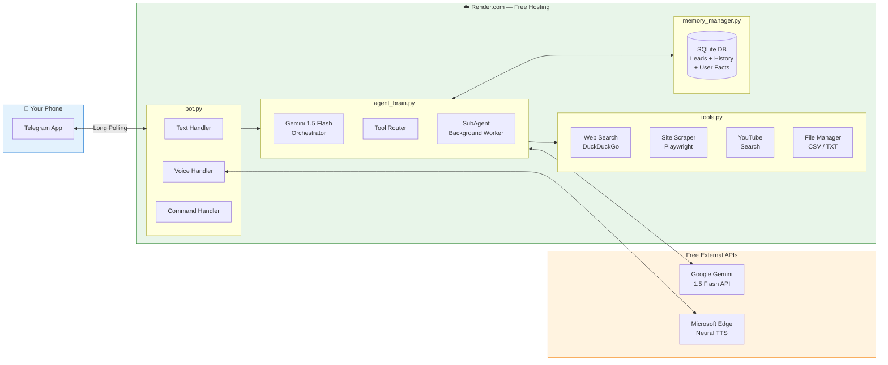
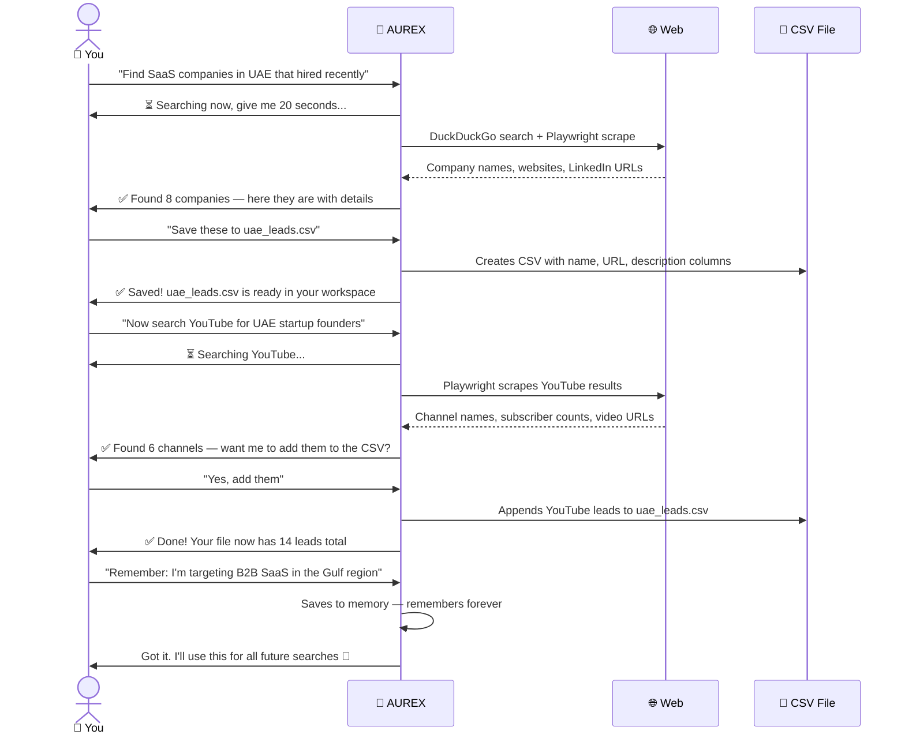
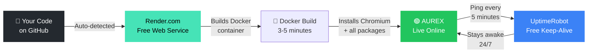
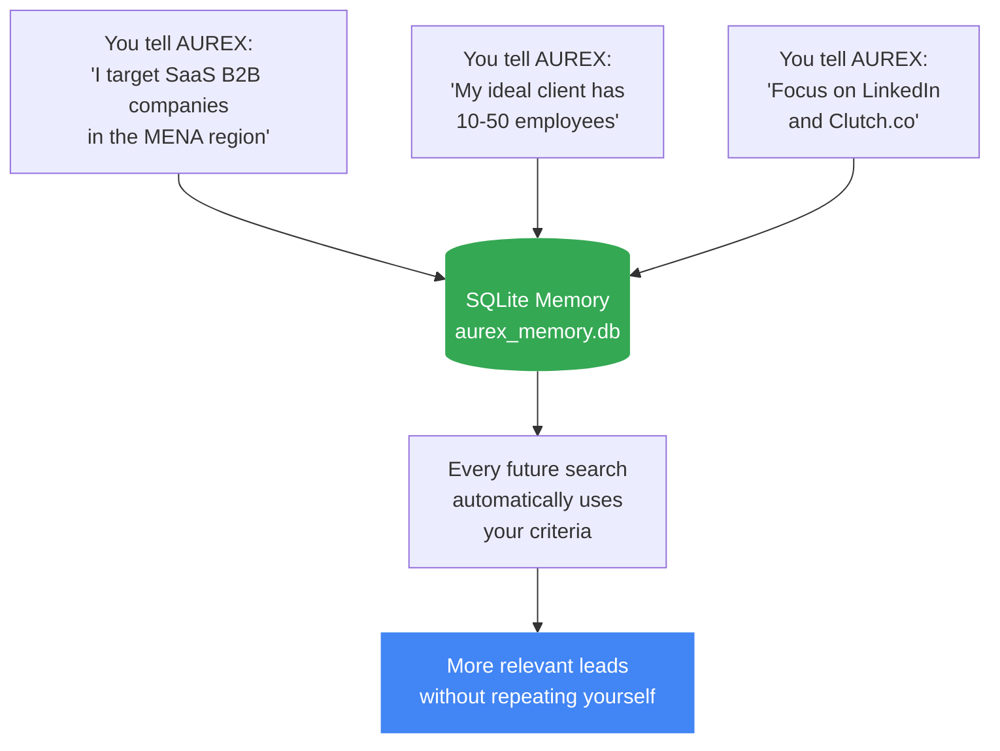

<div align="center">

```
 █████╗ ██╗   ██╗██████╗ ███████╗██╗  ██╗
██╔══██╗██║   ██║██╔══██╗██╔════╝╚██╗██╔╝
███████║██║   ██║██████╔╝█████╗   ╚███╔╝ 
██╔══██║██║   ██║██╔══██╗██╔══╝   ██╔██╗ 
██║  ██║╚██████╔╝██║  ██║███████╗██╔╝ ██╗
╚═╝  ╚═╝ ╚═════╝ ╚═╝  ╚═╝╚══════╝╚═╝  ╚═╝
```

### Advanced Universal Reasoning & Execution Assistant

**Your AI-powered lead generation engine — running 24/7 on your phone, for free.**

[](https://python.org)
[](https://aistudio.google.com)
[](https://t.me/botfather)
[](https://render.com)
[](LICENSE)

---

**[⚡ Quick Start](#-quick-start-5-minutes) · [🎯 Lead Gen Use Cases](#-using-aurex-for-lead-generation) · [🚀 Deploy Free](#-deploying-for-free-on-rendercom) · [🛠 How It Works](#-how-it-works)**

</div>

---

## What Is AUREX?

AUREX is a free AI assistant that lives inside Telegram on your phone. It is powered by Google's Gemini 1.5 Flash — the same AI technology used in enterprise tools — and it costs you absolutely nothing to run.

But here's what makes it genuinely useful for people hunting leads: AUREX can **search the web in real time**, **scrape any website**, **find YouTube channels of potential clients**, **save everything to a CSV file**, and **remember your search criteria across every session** — all without you opening a laptop. You just send a voice note or a text message and AUREX does the work.

Think of it as having a research assistant in your pocket who never sleeps, never charges by the hour, and never forgets what you told them last week.

---

## 🎯 Using AUREX for Lead Generation

This is where AUREX really earns its place. Here are real things you can say to it on Telegram right now:

```
"Search for SaaS startups in Dubai that raised funding in 2024"
```
```
"Find YouTube channels about real estate investing with over 10k subscribers"
```
```
"Scrape this LinkedIn company page and give me their contact info: [URL]"
```
```
"Save all of today's leads to a CSV file called dubai_saas_leads.csv"
```
```
"Search for e-commerce stores in Pakistan using Shopify"
```
```
"Find me the top 10 digital marketing agencies in London and save to agencies.csv"
```

AUREX searches, scrapes, extracts, and saves — and it **remembers your lead preferences** so next time you just say *"find more like the last batch"* and it knows exactly what you mean.

---

## 🔄 How It Works

Here is the full picture of what happens from the moment you send a message to when you receive your leads:



---

## 🏗 Architecture At a Glance



---

## 🎯 The Lead Generation Workflow

Here is exactly how a typical lead generation session works, from your first message to a saved CSV file full of prospects:



---

## 📁 Project Structure

```
AUREX-AI-ASSISTANT/
│
├── 🤖  bot.py               ← Telegram interface (text, voice, commands)
├── 🧠  agent_brain.py       ← Gemini LLM + SubAgent background system
├── 🛠   tools.py             ← Web search, scraping, YouTube, file manager
├── 💾  memory_manager.py    ← SQLite memory (leads, history, your preferences)
├── 🔊  voice_handler.py     ← Speech-to-text + neural text-to-speech
├── ⚙️   config.py            ← All settings in one place
│
├── 📋  requirements.txt     ← Python packages to install
├── 🐳  Dockerfile           ← Container ready for Render/HuggingFace
├── 🚀  render.yaml          ← One-click Render.com deployment config
└── 🔒  .env.example         ← Template for your API keys
```

---

## ⚡ Quick Start (5 Minutes)

### Step 1 — Get your two free keys

**Google Gemini API** (the AI brain):
1. Go to **https://aistudio.google.com/app/apikey**
2. Sign in with any Google account
3. Click **Create API Key** and copy it

**Telegram Bot Token** (how you talk to AUREX):
1. Open Telegram → search **@BotFather**
2. Send `/newbot` → follow the prompts
3. Copy the token it gives you (looks like `7123456789:AAFxxx...`)

---

### Step 2 — Install and run locally

```bash
# Clone the repo
git clone https://github.com/kalvin-lab/AUREX-AI-ASSISTANT.git
cd AUREX-AI-ASSISTANT

# Create a virtual environment
python -m venv venv
source venv/bin/activate        # Mac/Linux
venv\Scripts\activate           # Windows

# Install all dependencies
pip install -r requirements.txt

# Install the headless browser (one-time, ~170MB)
playwright install chromium

# Set up your keys
cp .env.example .env
# Open .env and fill in your TELEGRAM_BOT_TOKEN and GEMINI_API_KEY

# Run it!
python bot.py
```

Open Telegram, find your bot, send `/start` — AUREX is live.

---

## 🚀 Deploying for Free on Render.com

Running on your laptop is fine for testing, but to have AUREX working 24/7 — even when your phone is in your pocket and your computer is off — you need to host it. Render.com's free tier is perfect for this.



**The 7 steps:**

**1. Push to GitHub**
```bash
git init
git add .
git commit -m "Deploy AUREX"
git remote add origin https://github.com/yourusername/aurex.git
git push -u origin main
```
> Make sure `.env` is in `.gitignore` — never push your API keys to GitHub.

**2.** Go to **https://render.com** and sign up with your GitHub account.

**3.** Click **New +** → **Web Service** → connect your GitHub repo.

**4.** Use these settings:

| Setting | Value |
|---|---|
| Runtime | Docker |
| Instance Type | **Free** |
| Health Check Path | `/health` |
| Region | Oregon (US West) |

**5.** Add your environment variables in Render's dashboard:

| Key | Value |
|---|---|
| `TELEGRAM_BOT_TOKEN` | Your BotFather token |
| `GEMINI_API_KEY` | Your Google AI Studio key |
| `AUDIO_RESPONSE` | `true` |

**6.** Click **Create Web Service** and wait 3–5 minutes for the build.

**7. Keep it alive with UptimeRobot (free):**
- Go to **https://uptimerobot.com** → create a free account
- Add a new HTTP monitor pointing to `https://your-app.onrender.com/health`
- Set interval to **5 minutes**

That's it. AUREX is now running 24/7, totally free.

---

## 💬 Lead Generation Commands — Cheat Sheet

Once AUREX is running, here are the most useful things to say to it for finding leads:

| What you want | What to type |
|---|---|
| Search for companies | `Search for fintech startups in Singapore 2024` |
| Scrape a website | `Read this page and extract all contact info: [URL]` |
| Find YouTube leads | `Find YouTube channels about dropshipping with UK audience` |
| Save leads to file | `Save these results to leads.csv` |
| Read your saved leads | `Read the file leads.csv` |
| Remember your niche | `Remember: I target e-commerce brands doing $1M+ revenue` |
| Check what you've saved | `/files` |
| See your memory | `/memory` |
| Search voice | *Send a voice note saying what you want* |

---

## 🧠 What AUREX Remembers About You

Every fact you tell AUREX gets stored in its SQLite database and used in future sessions. This is powerful for lead generation because you can train it over time:



Use `/memory` to see everything AUREX knows about you. Use `/forget [key]` to delete something specific.

---

## 💰 Complete Cost Breakdown

| Tool | What it does | Monthly cost |
|---|---|---|
| Google Gemini 1.5 Flash | The AI brain — 1M free tokens/day | **$0** |
| Telegram Bot API | Your phone interface | **$0** |
| DuckDuckGo Search | Web search engine | **$0** |
| Playwright Chromium | Headless browser for scraping | **$0** |
| Microsoft Edge TTS | High-quality voice responses | **$0** |
| Render.com | 24/7 cloud hosting | **$0** |
| UptimeRobot | Keeps the server awake | **$0** |
| SQLite | Persistent memory storage | **$0** |
| **Total** | | **$0.00 / month** |

The only optional paid upgrade is a $1/month Render disk if you want your lead database to survive server restarts. For most users, it's not necessary.

---

## 🔧 Troubleshooting

**AUREX doesn't respond in Telegram**
→ Check your `TELEGRAM_BOT_TOKEN` is set correctly in your `.env` or Render dashboard. The token must be exact — even one wrong character breaks it.

**It says "quota exceeded"**
→ You've hit Gemini's free limit of 15 requests per minute. Wait 60 seconds and try again. For heavier use, add a short delay between searches.

**Web search returns nothing**
→ Run `playwright install chromium` again. On Render, this is handled by the Dockerfile automatically but double-check your build logs.

**Voice messages don't work**
→ Make sure `AUDIO_RESPONSE=true` is in your environment variables and `edge-tts` installed: `pip install edge-tts`

**The bot sleeps and takes 30 seconds to wake up**
→ You skipped the UptimeRobot step. Set it up — it takes 2 minutes and keeps the bot permanently awake.

**My CSV file disappeared after a Render redeploy**
→ Render's free tier uses ephemeral storage that resets on redeploy. Add a Render Disk ($1/month) to persist your files, or download important CSVs before redeploying.

---

## 🗺 Roadmap

Things that are coming next:

- [ ] **LinkedIn scraper** — extract profiles, job titles, company info from public pages
- [ ] **Email finder** — search for contact emails on company websites
- [ ] **Lead scoring** — AUREX ranks leads by how well they match your criteria
- [ ] **Export to Google Sheets** — sync your CSV leads directly to a spreadsheet
- [ ] **Scheduled searches** — tell AUREX to search every Monday morning and send results
- [ ] **WhatsApp support** — same bot, but on WhatsApp via Twilio sandbox

---

## 🤝 Contributing

Pull requests are welcome. If you build a new tool (LinkedIn scraper, email extractor, Google Maps lead finder), add it to `tools.py` following the existing pattern and open a PR.

The rule is simple: **everything must stay free forever**. No paid API dependencies.

---

## 📄 License

MIT License — free to use, fork, modify, and deploy commercially.

---

<div align="center">

**Built with Google Gemini · python-telegram-bot · Playwright · edge-tts · SQLite**

*If this saved you time or money on lead generation, give the repo a ⭐ — it helps others find it.*

[⭐ Star this repo](https://github.com/kalvin-lab/AUREX-AI-ASSISTANT) · [🐛 Report a bug](https://github.com/kalvin-lab/AUREX-AI-ASSISTANT/issues) · [💡 Request a feature](https://github.com/kalvin-lab/AUREX-AI-ASSISTANT/issues)

</div>
