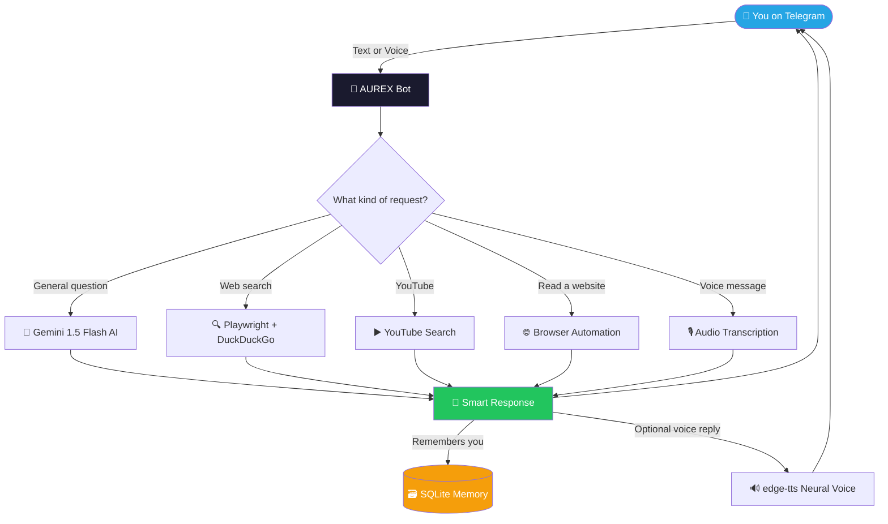
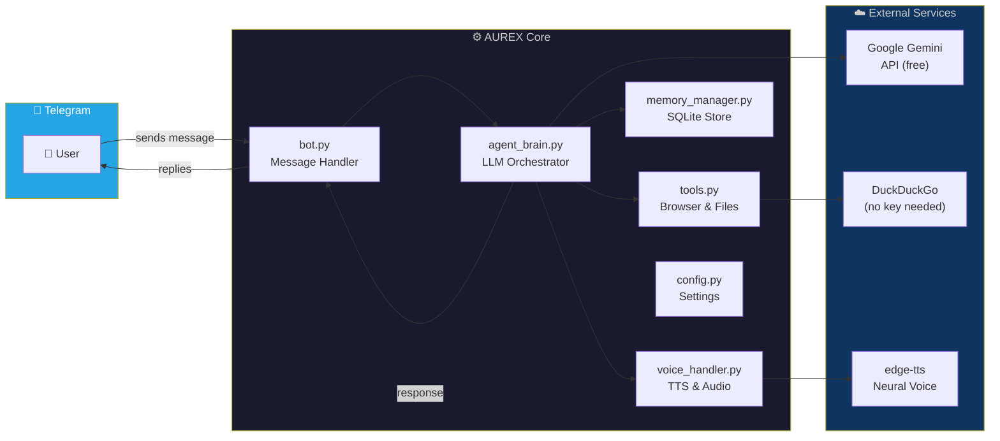
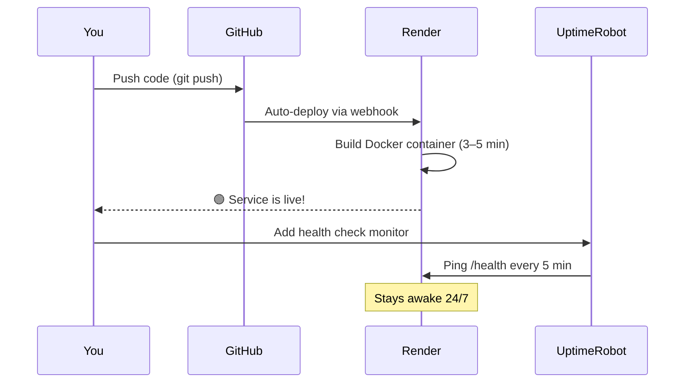

<div align="center">

```
 █████╗ ██╗   ██╗██████╗ ███████╗██╗  ██╗
██╔══██╗██║   ██║██╔══██╗██╔════╝╚██╗██╔╝
███████║██║   ██║██████╔╝█████╗   ╚███╔╝ 
██╔══██║██║   ██║██╔══██╗██╔══╝   ██╔██╗ 
██║  ██║╚██████╔╝██║  ██║███████╗██╔╝ ██╗
╚═╝  ╚═╝ ╚═════╝ ╚═╝  ╚═╝╚══════╝╚═╝  ╚═╝
```

### Your Personal AI Assistant — Right Inside Telegram

*Search the web · Watch YouTube · Talk by voice · Remember everything · Costs nothing*

---


</div>

---

## What is AUREX?

AUREX is a fully free AI assistant that lives in your Telegram. You talk to it like a person — type or speak — and it can search the web, find YouTube videos, read websites, remember things about you, and reply in your language. No subscriptions, no API fees, no credit card. Just a smart assistant always in your pocket.

> **Built for real people.** If you've ever wanted a personal AI assistant without paying $20/month for ChatGPT Plus, AUREX is for you.

---

## How It Works



---

## Features at a Glance

| Capability | What it does |
|---|---|
| 🧠 **AI Brain** | Google Gemini 1.5 Flash — fast, smart, free |
| 🔍 **Live Web Search** | Searches the real-time web via DuckDuckGo |
| 📺 **YouTube Search** | Finds videos by topic, returns clickable links |
| 🌐 **Read Any Website** | Paste a URL and AUREX summarises it |
| 🎙️ **Voice Messages** | Send a voice note — AUREX transcribes and replies |
| 🔊 **Voice Replies** | Speaks back using Microsoft Neural TTS (free) |
| 🧠 **Persistent Memory** | Remembers your name, preferences, facts across sessions |
| 📁 **File Creation** | Asks AUREX to create and save text files for you |
| 🔒 **Private Mode** | Lock the bot so only you can use it |
| 🌍 **Multilingual Voices** | English, Hindi, Urdu, Arabic and more |

---

## The Architecture



---

## Getting Started in 5 Minutes

You only need **two free keys** before you begin.

### Step 1 — Grab Your Gemini API Key (2 minutes)

1. Visit **https://aistudio.google.com/app/apikey**
2. Sign in with any Google account
3. Click **"Create API Key"**
4. Copy it — looks like `AIzaSyXXXXXXXXXXXXXX`

> Google gives you **1 million free tokens per day** and 15 requests per minute. You'll never hit the limit for personal use.

---

### Step 2 — Create Your Telegram Bot (3 minutes)

1. Open Telegram and search for **@BotFather** *(blue checkmark)*
2. Send `/newbot`
3. Give it a name: e.g. `AUREX Assistant`
4. Give it a username ending in `bot`: e.g. `aurex_myname_bot`
5. Copy the token — looks like `7123456789:AAFxxxxxxxxxxxxx`

**Want private mode?** Search for **@userinfobot** on Telegram, send `/start`, and copy your numeric user ID.

---

### Step 3 — Install and Run Locally

```bash
# Clone the repo
git clone https://github.com/kalvin-lab/AUREX-AI-ASSISTANT.git
cd AUREX-AI-ASSISTANT

# Install dependencies
pip install -r requirements.txt

# Install the headless browser (one-time, ~170MB)
playwright install chromium

# Linux users also run:
playwright install-deps chromium
```

Copy the example config and fill in your keys:

```bash
# Mac/Linux
cp .env.example .env

# Windows
copy .env.example .env
```

Open `.env` in any text editor and add your keys:

```env
TELEGRAM_BOT_TOKEN=7123456789:AAFxxxxxxxxxxxxx
GEMINI_API_KEY=AIzaSyXXXXXXXXXXXXXX
AUDIO_RESPONSE=true
LOG_LEVEL=INFO

# Optional — lock the bot to just your account:
ADMIN_USER_ID=123456789
```

Launch AUREX:

```bash
python bot.py
```

You should see:

```
╔══════════════════════════════════════════╗
║   🤖 A U R E X  v1.0.0                  ║
║   Powered by Google Gemini 1.5 Flash     ║
╚══════════════════════════════════════════╝

AUREX is running! Send /start on Telegram.
```

Open Telegram, find your bot, send `/start` — and you're live. 🎉

---

## Deploy Online (24/7 — Still Free)

Running on your computer means AUREX stops when you close the terminal. Here's how to host it in the cloud, for free, forever.

### Option A — Render.com *(Recommended)*



**Full steps:**

1. Push your code to a **private** GitHub repository:
   ```bash
   git init && git add .
   git commit -m "First AUREX deployment"
   git remote add origin https://github.com/yourusername/aurex.git
   git branch -M main && git push -u origin main
   ```
   > ⚠️ Double-check your `.env` file is NOT being pushed — it's in `.gitignore` but verify anyway.

2. Go to **https://render.com** → sign up with GitHub → **New+ → Web Service**

3. Connect your `aurex` repository and set:

   | Setting | Value |
   |---|---|
   | Runtime | Docker |
   | Instance Type | Free |
   | Health Check Path | `/health` |

4. Add environment variables under **Settings → Environment**:

   | Key | Value |
   |---|---|
   | `TELEGRAM_BOT_TOKEN` | Your BotFather token |
   | `GEMINI_API_KEY` | Your Google AI Studio key |
   | `AUDIO_RESPONSE` | `true` |
   | `LOG_LEVEL` | `INFO` |

5. Click **Create Web Service** — Render handles the rest.

6. **Keep it awake** — Render's free tier sleeps after 15 minutes of inactivity. Fix it with [UptimeRobot](https://uptimerobot.com) (free):
   - Monitor Type: `HTTP(s)`
   - URL: `https://your-service.onrender.com/health`
   - Interval: **5 minutes**

---

### Option B — Hugging Face Spaces

1. Go to **https://huggingface.co** → New Space → SDK: **Docker** → Hardware: **CPU Basic (free)**
2. Under **Settings → Repository Secrets**, add `TELEGRAM_BOT_TOKEN` and `GEMINI_API_KEY`
3. Push your code:
   ```bash
   git remote add hf https://huggingface.co/spaces/yourusername/aurex-bot
   git push hf main
   ```
   It builds and deploys automatically. Apply the same UptimeRobot trick.

---

## Talking to AUREX

Once running, just open Telegram and start chatting naturally:

```
You:    Hello! My name is Sara and I live in Karachi.
AUREX:  Nice to meet you, Sara! I'll remember that. How can I help today?

You:    Search for the latest news on AI
AUREX:  🔍 Searching the web... Here's what I found: [live results]

You:    Find me YouTube videos about sourdough bread
AUREX:  ▶️ Here are some great videos on sourdough: [links]

You:    Summarise this for me: https://example.com/article
AUREX:  🌐 Reading that page... Here's a summary: [...]

You:    [sends a voice message]
AUREX:  🎙️ I heard: "What's the weather like in London?"
        🌤️ According to the web, London is currently... [reply]
```

### All Commands

| Command | What it does |
|---|---|
| `/start` | Welcome message and quick overview |
| `/help` | Full list of features |
| `/memory` | See everything AUREX remembers about you |
| `/clear` | Wipe conversation history and start fresh |
| `/forget [topic]` | Delete one specific memory |
| `/files` | List files you've created in your workspace |
| `/stats` | View your usage statistics |

---

## Changing the Voice

Edit one line in `config.py`:

```python
TTS_VOICE = "en-US-AriaNeural"   # Default — US English female
```

Some popular choices:

| Voice Code | Description |
|---|---|
| `en-GB-SoniaNeural` | 🇬🇧 British English, female |
| `en-US-GuyNeural` | 🇺🇸 American English, male |
| `hi-IN-SwaraNeural` | 🇮🇳 Hindi, female |
| `ur-PK-UzmaNeural` | 🇵🇰 Urdu, female |
| `ar-SA-ZariyahNeural` | 🇸🇦 Arabic, female |
| `fr-FR-DeniseNeural` | 🇫🇷 French, female |

All voices are 100% free via Microsoft's edge-tts library.

---

## Troubleshooting

<details>
<summary><strong>🔴 AUREX isn't responding in Telegram</strong></summary>

- **Local:** Check that `python bot.py` is still running in your terminal
- **Render:** Go to your service dashboard → **Logs** tab — look for error messages
- Verify both `TELEGRAM_BOT_TOKEN` and `GEMINI_API_KEY` are set correctly

</details>

<details>
<summary><strong>🟡 "Quota exceeded" or "rate limit" error</strong></summary>

You've hit Gemini's free limit of 15 requests per minute. Wait 60 seconds and try again — it resets automatically.

</details>

<details>
<summary><strong>🟡 Web search or YouTube isn't working</strong></summary>

Playwright's Chromium browser needs to be installed:
```bash
playwright install chromium
```
On Render this runs automatically from the Dockerfile.

</details>

<details>
<summary><strong>🟡 Voice messages aren't working</strong></summary>

- Confirm `AUDIO_RESPONSE=true` is in your `.env` file
- Reinstall the TTS library: `pip install edge-tts --upgrade`

</details>

<details>
<summary><strong>🔴 The bot keeps going offline on Render</strong></summary>

Set up UptimeRobot pinging `/health` every 5 minutes — this is the most common issue people miss. See the deployment guide above.

</details>

---

## Total Cost Breakdown

| Service | Cost |
|---|---|
| Google Gemini API (1M tokens/day free) | **$0** |
| Telegram Bot | **$0** |
| DuckDuckGo web search (no key needed) | **$0** |
| Microsoft edge-tts (runs locally) | **$0** |
| Render.com hosting (free tier) | **$0** |
| UptimeRobot monitoring (free tier) | **$0** |
| **Monthly Total** | **$0.00** |

> The only optional paid item: persistent disk storage on Render ($1/month for 1GB), so memory survives server restarts. For personal use, free ephemeral storage works fine.

---

## Extending AUREX with Claude

Want to add features? Paste this prompt at the start of a Claude conversation:

```
I'm working on a Telegram AI assistant called AUREX. Here's the architecture:

- bot.py — handles all Telegram messages (text, voice, commands) via python-telegram-bot
- agent_brain.py — LLM orchestrator using Google Gemini 1.5 Flash
- tools.py — Playwright browser automation and file management
- memory_manager.py — persistent SQLite memory
- voice_handler.py — TTS (edge-tts) and audio processing
- config.py — all settings

Rules for this project:
1. Everything must remain 100% free forever — no paid APIs
2. Use Python 3.11 async/await throughout
3. New tools get added to TOOL_REGISTRY in tools.py
4. Fast tools (under 3s) go in INSTANT_TOOLS
5. Slow tools (browser/network) go in BACKGROUND_TOOLS
6. New tools must be described in AUREX_SYSTEM_PROMPT in agent_brain.py
7. All errors must be caught and return friendly messages to the user

What I want to add: [describe your feature here]
```

---

## Project Structure

```
AUREX-AI-ASSISTANT/
│
├── bot.py                  # Telegram message handler & command router
├── agent_brain.py          # Gemini LLM orchestrator & tool planner
├── tools.py                # Browser automation, YouTube, file tools
├── memory_manager.py       # SQLite-based persistent user memory
├── voice_handler.py        # Audio transcription & neural TTS
├── config.py               # All settings and environment variables
│
├── requirements.txt        # Python dependencies
├── Dockerfile              # Container config for cloud deployment
├── .env.example            # Template for your API keys
└── .gitignore              # Keeps your .env off GitHub
```

---

<div align="center">

**AUREX** — built entirely on free tools, for anyone who wants a smart personal assistant without paying a subscription.

*Give it a ⭐ on GitHub if it saved you money or time!*

</div>
